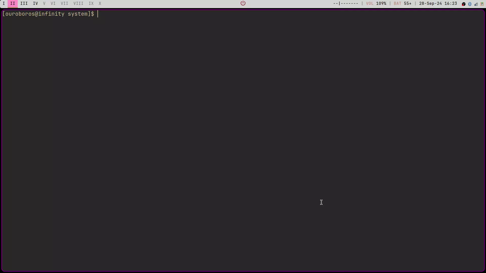
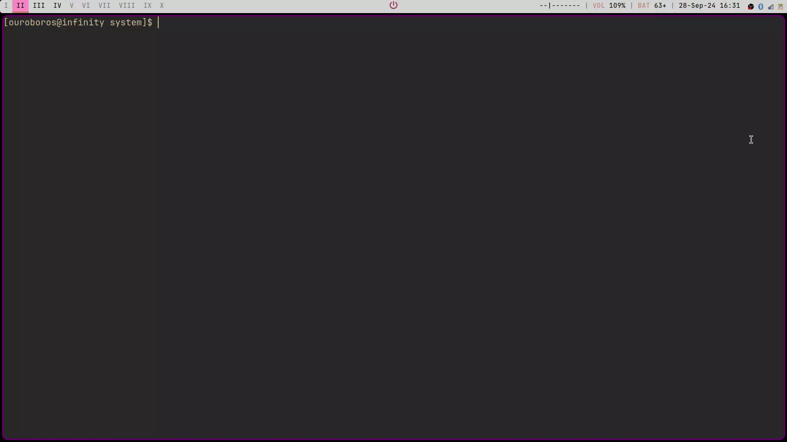

# Bad File Manager

A tui-based file manager that somehow manages to work. I wouldn't recommend this to anyone in good faith

Vim-key bindings are used to traverse the menu 
The program spawns a terminal in the directory it is in, when it exits

## Usage
- run build.sh while in the project directory, after which sfm can be called from anywhere to see the file manager tui

- calling sfm directly

- An directory name can be passed as argument. 
The program will start running from that directory

- xdg-open is used to open the files
